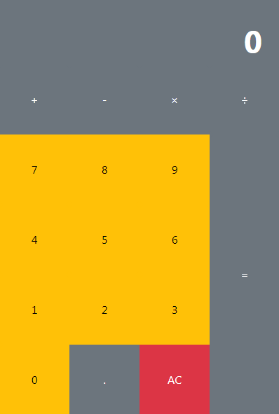

# RMI

RMI (Java Remote Method Invocation) is a mechanism offered by Java to invoke a method remotely. It is part of the standard Java runtime environment and provides a simple mechanism for server communication in distributed applications based exclusively on Java. Este proyecto presenta una interacción cliente servidor RMI en Java. Una calculadora que sus métodos son ejecutado en el servidor. Este proyecto es un ejemplo simple para comprender la implementación de un servidor y cliente RMI.

## Features
- Java Web with Servlets. (The index.html can be replaced by an index.jsp file)
- Client Web and desktop Server RMI.
- Use of library JQuery and Bootstrap 5.
- Commented code on the server side.
- Project developed in Netbeans 8.2

## Web Application

